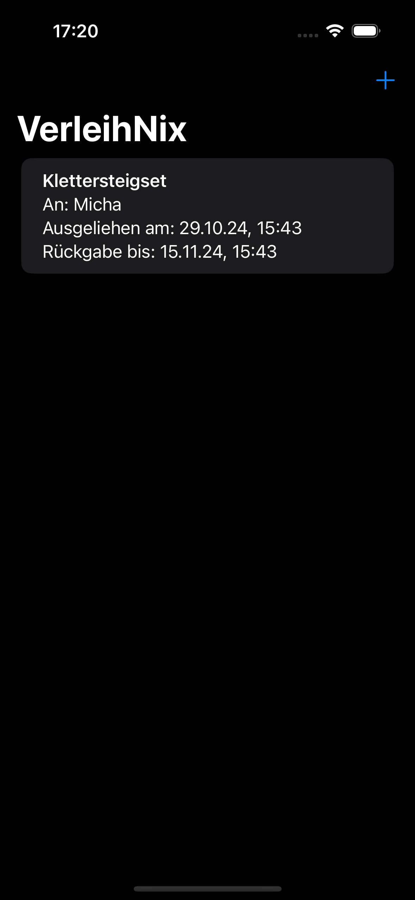
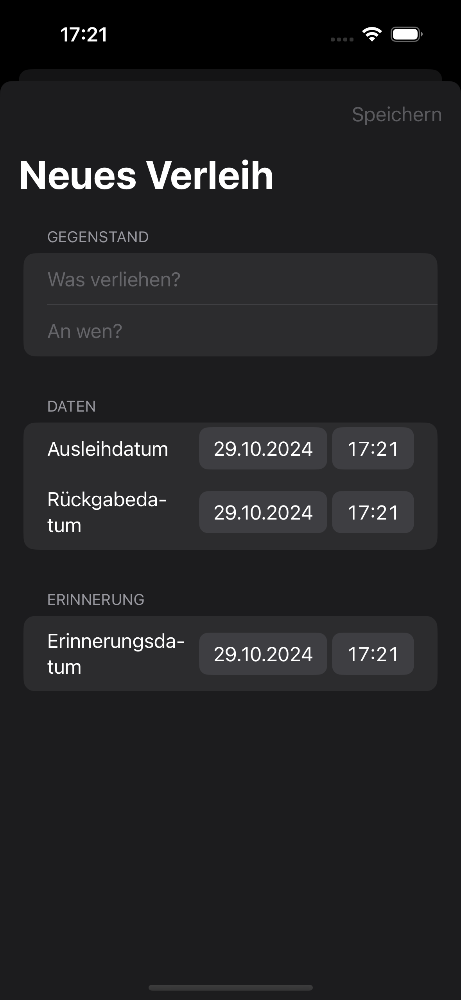
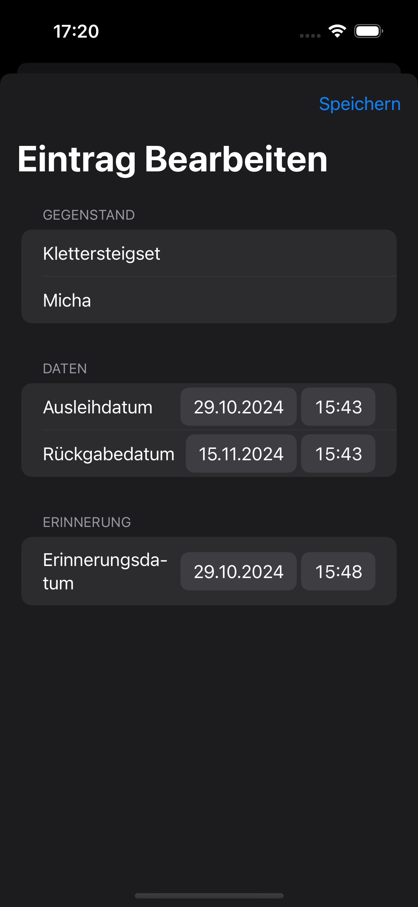

# VerleihNix


**VerleihNix** is a SwiftUI-based application designed to help users manage their borrowed and lent items efficiently. Whether you're tracking borrowed books, tools, or other items, VerleihNix offers a seamless experience for adding, editing, and viewing borrowed items.

## Table of Contents

- [Features](#features)
- [Screenshots](#screenshots)
- [Installation](#installation)
- [Usage](#usage)
- [Testing](#testing)
- [Motivation](#motivation)
- [Contributing](#contributing)
- [License](#license)
- [Contact](#contact)

## Features

- **Add Items:** Easily add new items with details such as name, borrower, due date, and status.
- **Edit Items:** Modify existing information to keep your loaned items up-to-date.
- **Search & Filter:** Quickly find specific items using search and filter functionalities.
- **User-Friendly Interface:** Clean design for easy navigation and management.

## Screenshots



*Main Screen displaying a list of borrowed items.*


*Item View displaying details of a borrowed item.*



*Add Item screen with form fields.*



*Edit Item screen with form fields.*

## Installation

### Prerequisites

- **Xcode:** Ensure you have Xcode installed. Download it from the Mac App Store.
- **Swift 5.0:** Comes bundled with Xcode.
- **Git:** To clone the repository.

### Steps

1. **Clone the Repository:**

    ```bash
    git clone https://github.com/username/verleihnix.git
    cd verleihnix
    ```

2. **Open the Project in Xcode:**

    ```bash
    open VerleihNix.xcodeproj
    ```

## Usage

Once the app is running:
* Add Items: Tap the "+" button to add a new item.
* Edit Items: Swipe left on an item in the list to reveal the "Edit" option.
* Delete Items: Swipe left on an item in the list to reveal the "Delete" option.
* Search & Filter: Use the search bar and filters at the top to find specific items.

## Testing

To run tests for **VerleihNix**:

1. Open the Test Navigator by pressing Command + 6 in Xcode.
2. Click the Run button next to VerleihNixTests to execute all unit tests.
3. For UI tests, run the tests under VerleihNixUITests.

Alternatively, you can run all tests using the Product menu:

```bash
Product > Test
```

## Motivation

The inspiration for **VerleihNix** arose from the need to manage borrowed items in a simple way. With no existing solutions meeting my specific needs, VerleihNix was designed to focus on ease of use and customization.

## Contributing

Contributions are welcome! If you have ideas or improvements, feel free to fork the repository and submit a pull request. Follow best practices when contributing.

## License

**VerleihNix** is licensed under the **GNU General Public License v3.0** - see the [LICENSE](https://www.gnu.org/licenses/gpl-3.0.html) file for details.

### Key points of the GNU GPLv3:

- **Freedom to use, modify, and distribute**: You are free to use, modify, and distribute this software, as long as you adhere to the GPLv3 conditions.
- **Copyleft**: Any modifications or derived works must also be distributed under the GPLv3 license.
- **Source code availability**: If you distribute the software, you must make the full source code available, including any modifications.
- **Patent protection**: The license prevents any patent claims against users of the software.
- **No "Tivoization"**: Hardware that uses GPLv3 software must allow installation of modified software by users.

For more information, refer to the [official GPLv3 license](https://www.gnu.org/licenses/gpl-3.0.html).

## Contact

For inquiries or feedback, feel free to contact me at [Nobo](mailto:nobo_code@posteo.de?subject=[GitHub]%20VerleihNix).
